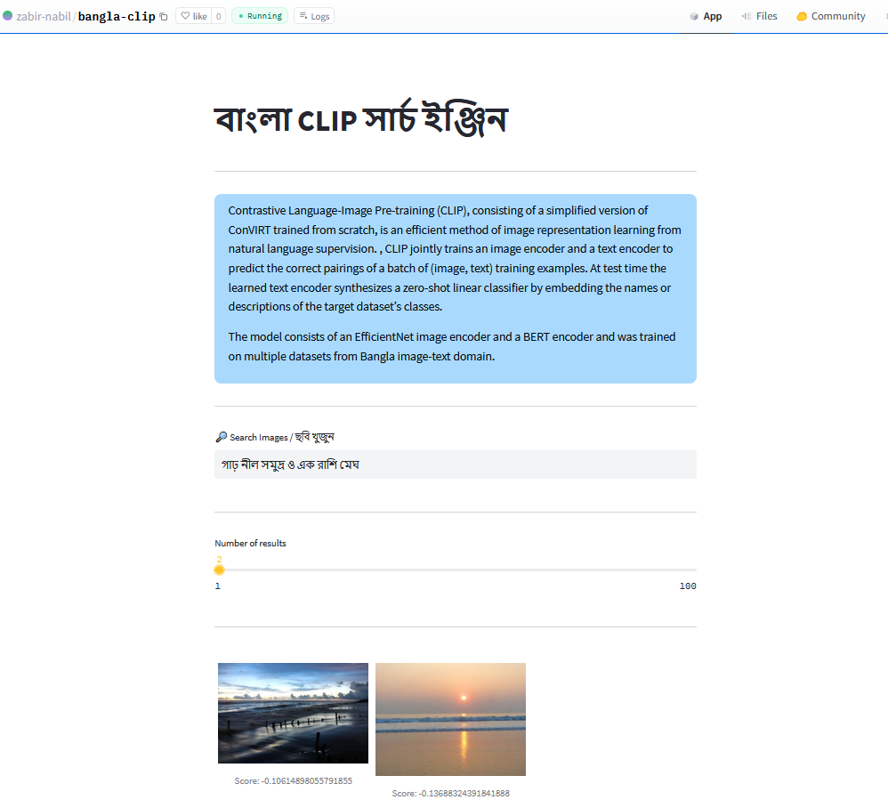
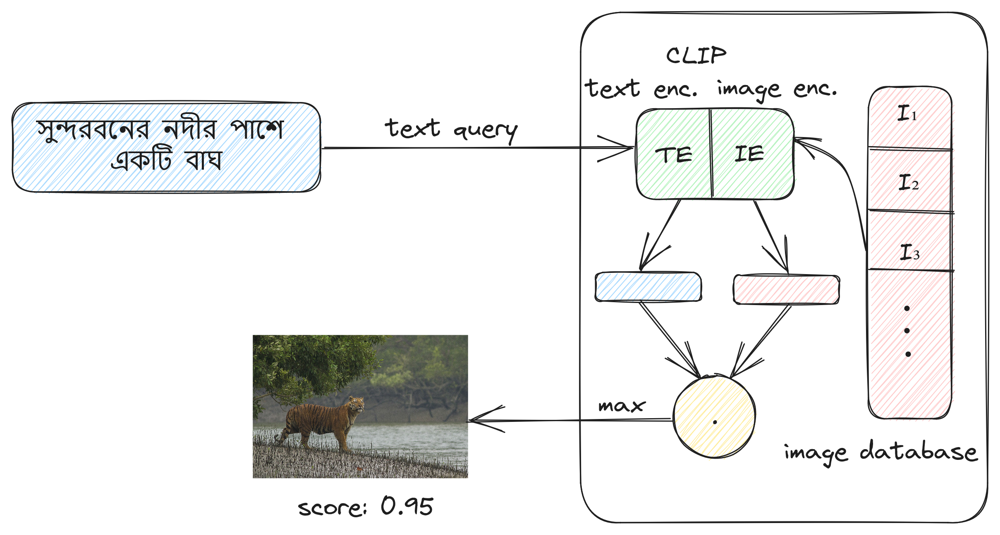

<p align="center">
  <a href="#"></a>
</p>
<p align="center">
    <em>CLIP (Contrastive Language–Image Pre-training) training code for Bangla.</em>
</p>
<p align="center">
    <em>Live Demo: </em> <a href="https://huggingface.co/spaces/zabir-nabil/bangla-clip">HuggingFace Space</>
</p>

---

#### Installation

* `python >= 3.9`
* `pip install -r requirements.txt`


### Bangla CLIP

<p align="center">
  <a href="#"></a>
</p>

The model consists of an EfficientNet / ResNet image encoder and a BERT text encoder and was trained on multiple datasets from Bangla image-text domain. To start training,

```console
python train_clip_bangla.py
```
---


### Image Search Demo with Bangla CLIP

 * *Search App Code:* [bangla-image-search](https://github.com/zabir-nabil/bangla-image-search)
 * *Article:* [medium](https://medium.com/@furcifer/a-dead-simple-image-search-engine-for-bangla-using-clip-contrastive-language-image-pre-training-a1f7f50b8419)


